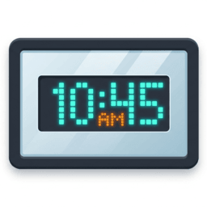

<p align="center">
  
</p>

# MirrorClock-Firmware v1.1.0

## Overview
MirrorClock-Firmware is a modern, efficient firmware designed for the "23-er Platine" from Bastelgarage.ch. This firmware provides smooth LED control, a modern web dashboard, seamless Home Assistant integration, and a clean REST API interface for remote control and monitoring, with improved code structure and stability compared to the original firmware.

## Features
### Core Functionality
- **Word Clock Display**: Shows time in natural language using illuminated LED matrix
- **NeoPixel LED Control**: Drives 114 individually addressable LEDs
- **Automatic Time Sync**: NTP-based time synchronization with configurable timezone
- **Auto Brightness**: BH1750 light sensor for automatic brightness adjustment
- **WiFi Connectivity**: Reliable WiFi connection with connection monitoring
- **Web Dashboard**: An integrated modern React-based web interface for easy configuration and control
- **Home Assistant Integration**: Native custom component for seamless integration into your smart home
- **MQTT Support**: Completely rewritten, flawless MQTT integration for reliable communication with third-party systems

### Hardware Support
- **ESP8266**: Optimized for ESP8266 microcontroller
- **NeoPixel LEDs**: 114 WS2812B LEDs in word clock matrix layout
- **BH1750 Light Sensor**: Ambient light detection for automatic brightness
- **I2C Communication**: Light sensor interface via configurable pins

## Configuration
### WiFi Setup
Edit the WiFi credentials in `config.cpp`:
```cpp
const char* WIFI_SSID = "Your_WiFi_Network";
const char* WIFI_PASSWORD = "Your_Password";
```

### Hardware Configuration
The firmware supports the following configurable parameters in `config.h`:
- **LED Configuration**: Pin assignment, LED count, default colors and brightness
- **Light Sensor**: I2C pins, brightness calibration range
- **Time Settings**: NTP server, timezone configuration
- **Debug Output**: Enable/disable comprehensive debug logging

### Debug Mode
The firmware includes a comprehensive debug system with module-specific prefixes:
- `[WIFI]` - WiFi connection status and diagnostics
- `[LED]` - LED operations and display updates
- `[TIME]` - NTP sync and time operations  
- `[SENSOR]` - Light sensor readings and auto-brightness
- `[WEB]` - REST API calls and server status
- `[SYSTEM]` - System startup, memory usage, and periodic status

Enable debug output by setting `DEBUG_ENABLED true` in `config.h`.

## Getting Started
1. **Hardware Setup**: Connect the ESP8266 to the LED matrix and BH1750 light sensor
2. **Configuration**: Update WiFi credentials and hardware pins in config files
3. **Upload**: Flash the firmware to your ESP8266 using Arduino IDE
4. **Connect**: The device will connect to WiFi and start the web server on port 80
5. **Control**: Open the IP address in your browser to access the Web Dashboard, or integrate it with Home Assistant.

### Arduino IDE Setup
Required libraries:
- ESP8266WiFi
- ESP8266WebServer
- Adafruit NeoPixel
- BH1750
- ArduinoJson
- Time

## REST API Reference
The firmware provides a comprehensive REST API for remote control.
For full details, endpoints, and examples, please see the [API Reference](API_REFERENCE.md).

## File Structure
```
MirrorClock_Firmware/
├── MirrorClock_Firmware.ino    # Main Arduino sketch
├── config.h                    # Hardware and feature configuration
├── config.cpp                  # Configuration implementation
├── wifi_connection.h           # WiFi connection management
├── web_api.h                   # REST API implementation
├── time_sync.h                 # NTP time synchronization
├── led_driver.h                # NeoPixel LED control
├── light_sensor.h              # BH1750 sensor interface
├── mqtt_manager.h              # MQTT communication module
└── lines.h                     # Word clock LED mapping

MirrorClock_Dashboard/          # React-based web dashboard
MirrorClock_HA-integration/     # Home Assistant custom component
```

## Troubleshooting
### Common Issues
- **WiFi Connection Failed**: Check SSID/password in `config.cpp`
- **Time Not Syncing**: Verify internet connection and NTP server access
- **LEDs Not Working**: Check LED pin configuration and power supply
- **API Not Responding**: Ensure device is connected to WiFi and check IP address
- **Dashboard Not Loading**: Ensure the firmware contains the statically compiled dashboard header or rebuild the dashboard.

### Debug Output
Enable debug mode in `config.h` and monitor serial output at 115200 baud for detailed diagnostic information.

## Contributing
Contributions are welcome! Please feel free to:
- Report bugs via GitHub issues
- Suggest new features or improvements
- Submit pull requests with fixes or enhancements
- Share your hardware configurations and modifications

## Acknowledgments
- Bastelgarage.ch for the original "23-er Platine" design
- Arduino and ESP8266 community for excellent libraries and support

Thank you for using MirrorClock-Firmware! 🕐✨
